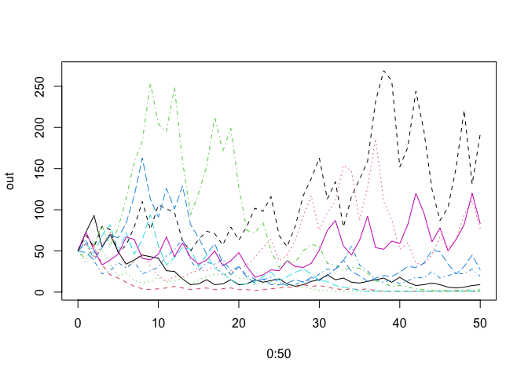

<!-- README.md is generated from README.Rmd. Please edit that file -->

# primer

<!-- badges: start -->

<!-- badges: end -->

The goal of primer is to .maintain functions used in \[Primer of Ecology
Using R\] (<https://hankstevens.github.io/Primer-of-Ecology/>)

## Installation

You can install the released version of primer from
[CRAN](https://CRAN.R-project.org) with:

``` r
install.packages("primer")
```

And the development version from [GitHub](https://github.com/) with:

``` r
# install.packages("devtools")
devtools::install_github("HankStevens/primer")
```

## Example

Stochastic density-independent population dynamics.

``` r
library(primer)
#> Loading required package: deSolve
#> Loading required package: ggplot2

# random finite rates of increase
lambdas <- runif(10, .5, 1.5)

# stochastic dynamics
out <- PopSim(Rs=lambdas, years=50, N0=50)
matplot(0:50, out, type='l')
```



``` r

# distribution of final population sizes
summary(out[51,])
#>    Min. 1st Qu.  Median    Mean 3rd Qu.    Max. 
#>     1.0     1.5    14.0    41.3    64.5   192.0
```
